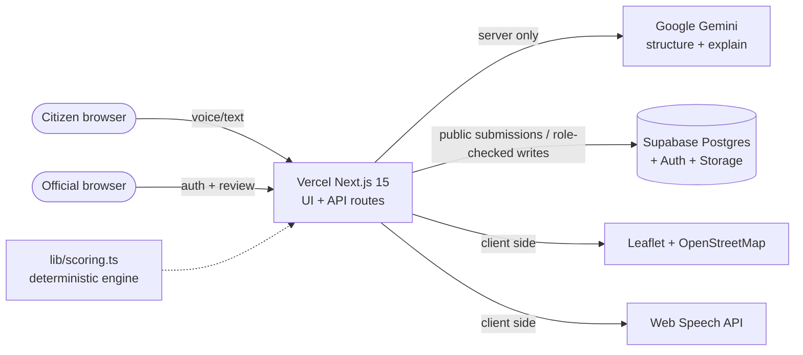

# BudgetMirror AI

**Spending visible. Mismatches explained. Outcomes verified.**

BudgetMirror AI is a multilingual public-accountability platform for Sampurna District (demo) that holds three mirrors up to every ward:

1. **Citizen needs** — anonymous text/voice reports (Hindi, Marathi, Kannada, Tamil, Telugu, English), AI-translated & categorised.
2. **Government budgets** — CSV/PDF allocations, human-reviewed before they touch the ledger.
3. **Ground outcomes** — project lifecycle + citizen validations that alone can certify impact.

Where spending drifts from need, deterministic scores say so — loudly, and with receipts.

> **Decision-support only. Final funding decisions remain with authorized officials.**

---

## Demo in 2 minutes

```bash
npm install
npm run dev        # open http://localhost:3000 — works fully offline, no keys needed
```

No Supabase? No Gemini key? **The app still runs.** Public pages use the seeded Sampurna District story; the admin demo workspace is available only in local development without Supabase (with a demo mode banner). In production, admin pages and official APIs fail closed without Supabase.

### The script (wire-for-wire)

For the admin steps, use the local offline demo or sign in with an official account on a configured deployment.

1. **`/report`** — submit: *“There has been no water supply in Ward 5 for three days. The school is also affected.”*
   (Or the Hindi variant: *“वार्ड 5 में तीन दिन से पानी नहीं आ रहा है।”*) — try the voice input button too.
2. **`/report/success`** — tracking ID + AI translation, category *Water Supply*, high urgency, department routing.
3. **`/admin/dashboard`** — Ward 5 water demand spike; Demand-vs-Budget hero chart; hotspot map; top-3 actions.
4. **`/admin/mismatch`** — water: demand **93** vs budget **11%**; decorative lighting **54%**; alignment **31**.
5. **`/admin/recommendations`** — pipeline rehabilitation: review ~₹12L lighting → water; ~8,400 residents + 2 schools. Download the policy brief.
6. **`/projects`** → validate a project with a star rating + *resolved/partial/no* → watch the impact score on **`/admin/impact`**.
7. Close: *spending visible, mismatches explained, outcomes verified.*

---

## Architecture



**Key principle:** AI *structures and explains*; all money-adjacent math is pure, auditable TypeScript in `lib/scoring.ts`. Same inputs → same outputs, every time.

### Routes

| Public | Official routes (login public; workspace protected in production) | API |
|---|---|---|
| `/` landing | `/admin/login` | `POST /api/analyze-report` |
| `/report` + `/report/success` | `/admin/dashboard` | `POST/PUT /api/upload-budget` |
| `/transparency` | `/admin/reports` | `POST /api/recalculate-metrics` |
| `/projects`, `/projects/[id]` | `/admin/mismatch` · `/admin/recommendations` | `POST /api/generate-recommendation` |
| | `/admin/projects` · `/admin/impact` · `/admin/budgets` · `/admin/budget-upload` | `PATCH /api/reports` · project validate/status |

---

## Scoring formulas (deterministic)

**Demand (0–100)** = `count×0.35 + urgency×0.25 + validations×0.15 + vulnerable×0.15 + duration×0.10`
(count normalised against a 60-report ward scale; see `demandFactorsFromReports`)

**Alignment** = `max(0, round(100 − |demandShare − budgetShare| × 100))`
> Ward 5 water: `|0.80 − 0.11| = 0.69` → alignment **31**

**Priority** = `0.35×demand + 0.25×fundingGap + 0.15×severity + 0.10×vulnerable + 0.10×delay + 0.05×validation`

**Impact** = `0.40×resolution + 0.25×satisfaction + 0.20×complaintReduction + 0.15×onTimeInBudget`

**Mismatch labels:** High demand + low funding → *Underfunded Critical Need* · Low + high → *Potential Overspending / Review* · High + high → *Aligned Priority* · Low + low → *Monitor*.

---

## Design system — “Civic Mirror”

Public-ledger-meets-field-journalism: **Newsreader** serif headings, **IBM Plex Sans** body, **IBM Plex Mono** for IDs/amounts. Ink navy `#0B1F33`, warm paper `#F4EFE6`, signal teal `#0F766E`, alert coral `#C45C26`, budget gold `#B98A2F` (hairlines reserved for money moments). Ledger rules, cadastral grid watermarks, restrained 150–250ms motion, dark mode, mobile-first, keyboard-friendly. Tokens: `lib/design-tokens.ts` + `tailwind.config.ts`.

---

## Setup (full-stack mode)

### 1. Supabase

1. Create a free project at supabase.com.
2. For a new project, run `supabase/schema.sql` in the SQL Editor, then `supabase/seed.sql`. For an existing deployment, apply `supabase/migrations/20260924_admin_authorization.sql` before deploying this hotfix and review existing official profiles for unauthorized grants.
3. Auth → create a user (email/password) → in `profiles`, set that user's `role` to `admin`.
4. Copy Project URL + `anon` key + `service_role` key.

### 2. Gemini (free tier)

Get a key at Google AI Studio (aistudio.google.com). **Server-only** — never expose to the browser. Without it, the app uses the deterministic fallback (manual category + raw text + urgency 50) and everything still demos.

### 3. Env

```bash
cp .env.local.example .env.local   # then fill in
```

| Var | Scope |
|---|---|
| `NEXT_PUBLIC_SUPABASE_URL` / `NEXT_PUBLIC_SUPABASE_ANON_KEY` | browser-safe |
| `SUPABASE_SERVICE_ROLE_KEY` | **server only** |
| `GEMINI_API_KEY` | **server only** |
| `NEXT_PUBLIC_APP_URL` | browser-safe |

### 4. Run / verify

```bash
npm install
npm run typecheck && npm run lint && npm run test:ci && npm run build
npm run dev
```

### 5. Deploy (Vercel, free)

1. Push to GitHub → Import in Vercel (auto-detects Next.js).
2. Add the 5 env vars above in Project Settings.
3. Preview deploys on every PR; production on `main`. No Docker, no AWS, no paid services.

CI (`.github/workflows/ci.yml`) runs **lint → typecheck → auth regression tests → build** on every push/PR to `main`, without real service-role or Gemini credentials.

---

## Data model

`wards` → `citizen_reports` (+`report_validations`) · `budget_uploads` → `budget_allocations` → `projects` → `project_validations` · `ward_category_metrics` (recomputed) · `profiles`. RLS: public read on anonymised data, anon insert for reports/validations with column guards, official-only writes for budgets/projects, `budget-docs` bucket official-only. The server independently verifies the user and `profiles.role` before every admin API call. Full DDL in `supabase/schema.sql`.

**Categories (10):** Water Supply · Sanitation & Drainage · Roads & Mobility · Education · Healthcare · Electricity · Waste Management · Digital Infrastructure · Agriculture & Irrigation · Public Safety.

---

## Manual test checklist (10)

1. Cold load `/` with **no env** → landing renders, ledger excerpt shows alignment 31.
2. `/report` → submit English water text → success page shows tracking ID + Water Supply + urgency ≥ 80 (fallback: 50 + notice).
3. `/report` → Hindi text + voice button → language chips switch recognition locale; unsupported browser shows graceful note.
4. `/transparency` → Ward 5 chart shows water 93 vs 11%; map shows coral Ward-5 hotspot; text fallback under chart.
5. `/admin/dashboard` (local demo mode or official account) → 4 metric cards, critical table, top-3 recs; ward switcher rescopes chart.
6. `/admin/mismatch` → heat strip + ranked table; lighting badge reads *Potential Overspending / Review*.
7. `/admin/recommendations` → Rec #1 is pipeline rehab (~₹12L); brief downloads as `.md`; print hides nav.
8. `/admin/budget-upload` → upload `public/sample-budget.csv` → review grid matches wards → approve → counts confirmed (a non-persistent receipt in the local demo).
9. `/projects/[id]` → submit a 4-star rating + feedback → validation receipt; `/admin/impact` shows impact math.
10. `/admin/reports` → filter urgency 70+ + flag a spam row → status updates (live mode) or demo receipt.

---

## Free-tier limits & notes

- **Gemini free tier:** rate-limited; every call has a deterministic fallback — quota errors never break a page.
- **Supabase free tier:** 500 MB DB + 1 GB storage is plenty for this schema; RLS policies included.
- **Vercel hobby:** fine for demo traffic; API routes are stateless serverless functions.
- **PDF text extraction** is intentionally naive (text-based PDFs) — scanned/image PDFs need an OCR step (stretch).
- Stretch items shipped: PDF path, EN/HI UI labels, AI brief generator, spam flagging, print stylesheet, dynamic map/chart imports.

## License

MIT — see `LICENSE`. Built as a hackathon-ready Digital Public Good prototype.
